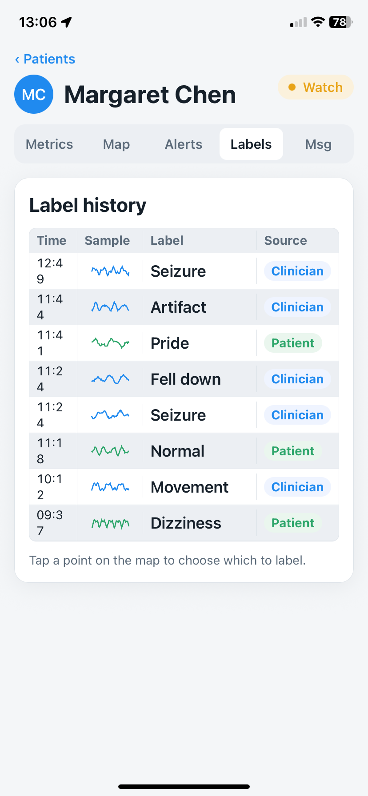
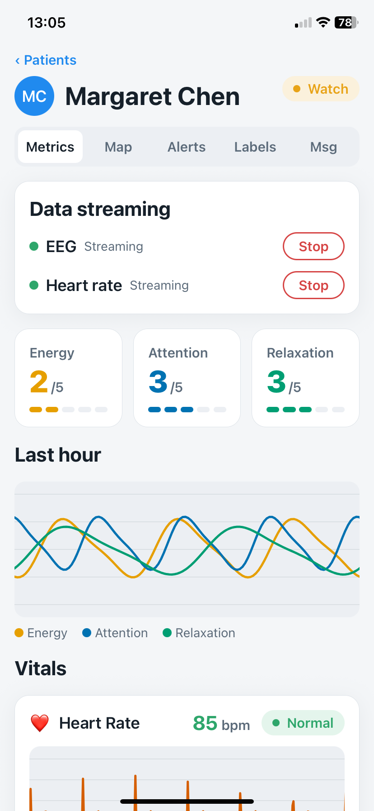
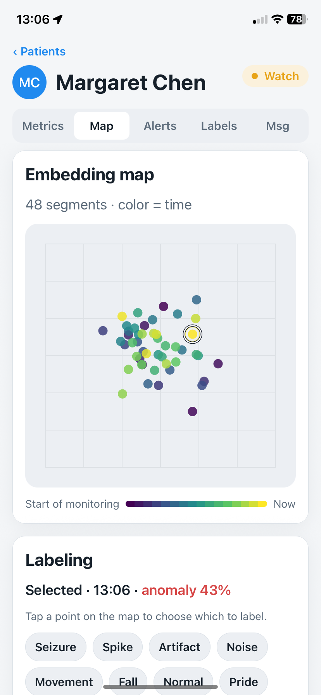

# BetterNǎo

Links:

- Business video link: [https://youtu.be/-UXYmAW1FtU](https://youtu.be/-UXYmAW1FtU)

- Technical video link: [https://www.youtube.com/watch?v=-UN_MN14Gjw](https://www.youtube.com/watch?v=-UN_MN14Gjw)


EEG wellbeing monitoring for care teams. Built at the Neurohackathon 2026 (Hong Kong, HealthTech track).

BetterNǎo turns continuous EEG into something a family or care team can actually
read. A clinical-grade EEG **foundation model** embeds each window of brain
activity; the app shows that as a calm wellness signal for the patient and a
detailed, labelable monitoring view for the clinician — in English and 简体中文.

> What is real vs. simulated in this demo is documented in [`HONESTY.md`](./HONESTY.md).

<p align="center">
  
  
  
</p>

## What it does

**Patient app** — a calm, large-type home screen:
- A living **wellness orb** reflecting current brain state (no scary numbers).
- **Check-in**: tap and speak ("I feel a little dizzy") — a small LLM turns it into a clinical label for the care team.
- **Medicine** logging and a realtime **chat** with the care team.

**Caregiver app** — a clinical monitoring view per patient:
- **Metrics** — live EEG + heart-rate waveforms and vitals.
- **Map** — the patient's EEG embeddings over time as an interactive map (pan / zoom), colored by time, with outlier / anomaly detection.
- **Labels** — review the label history and add labels by voice or tap, pinned to a point on the map.
- **Alerts** and realtime **chat** with the patient.

**Streaming demo (`/demo`)** — watch a brain drift from **healthy → dementia**.
Each point is a 30-second window of **real clinical EEG**, embedded live by the
foundation model.

## Run it

**You need**
- **Node ≥ 20** (`.nvmrc`) + npm
- **Docker Desktop** + **Supabase CLI** (`brew install supabase/tap/supabase`) — local backend
- **uv** (`brew install uv`) — Python pipeline + seed scripts
- An **OpenRouter API key** for voice → label (already in `.env.example` for the team)
- *(optional)* **neuroencoder model weights** (gated Hugging Face repo) — only to (re)generate embeddings; not needed to run against the seeded DB

**Setup (once)**
```bash
nvm use && npm ci                 # app dependencies
npx setup-skia-web public         # CanvasKit WASM for web -> public/canvaskit.wasm
cp .env.example .env.local        # fill SUPABASE keys from `supabase status`
```

**Run**
```bash
npm run setup     # fresh clone: supabase + seed all demo data + app + live stream
npm run dev       # later runs: supabase + app + live stream
```

Press **`w`** for the web app, then open `/demo`. For a phone, build a **dev
client** (`npx expo run:ios` / `run:android`) — Skia and `expo-audio` aren't in
Expo Go — and keep the phone on the same Wi-Fi (the Supabase host auto-resolves,
no manual IP).

**Demo logins** (one tap on the login screen):
**Margaret Chen** (patient) · **Dr. Mei Nguyen** (caregiver).

Browse the database at Supabase Studio: <http://127.0.0.1:54323>

### Docker workflow (recommended)

Run Python app in Docker. Supabase still runs host-side (via its own CLI); Expo still runs on host so Metro can talk to the simulator/device.

**Once per machine**, log in to Hugging Face inside the container so the
gated `Neuroencoder/epi-embedding` model weights + token are stored in the
`hf-cache` named volume:

```bash
docker compose run --rm pipeline uv run hf auth login
```

Then with two commands we can cover the whole loop:

| Command | When to use it |
|---|---|
| `npm run seed` | After `supabase db reset` (or on a fresh Supabase). Runs all three seed scripts (`seed_eeg` → `compute_umap` → `seed_trajectory`) inside the container against the host DB. |
| `npm run demo` | Every time you want to run the demo. Starts host Supabase (idempotent), boots the streaming pipeline container, and launches Expo, in one terminal. Ctrl-C shuts down both gracefully. |

The container reaches the host's Supabase via `host.docker.internal:54321`.
First `demo` builds the image (~2 min) and downloads the foundation model
weights once; subsequent runs start in seconds.

**Seed scripts, in order:**
- `scripts/seed_eeg.py` — creates demo patients (Margaret, Harold, Sofia) +
  caregivers, and seeds `eeg_segments` derived from the real `sub-001`
  recording through the foundation model.
- `scripts/compute_umap.py` — fits UMAP on those embeddings and writes
  `umap_x`/`umap_y` back per row (drives the caregiver **Map** tab).
- `scripts/seed_trajectory.py` — seeds the 530-point healthy→dementia
  trajectory into a "Trajectory Demo" patient. This is what powers
  <http://localhost:8081/demo>; without it the Play button has nothing to
  play.

All three are idempotent & re-running replaces existing rows.

## Tests


| Command | What it runs |
|---|---|
| `npm test` | `tsc --noEmit` + fast pytest suite. Matches CI. |
| `npm run test:py` | Fast pytest only. |
| `npm run test:slow` | The foundation-model tests (requires HF auth + ~2min cold-start). |
| `npm run test:e2e` | Runs `supabase db reset` then the full seed pipeline against the local DB, asserting the demo state (users, segments, UMAP coords). **CAUTION**: deletes local Supabase data. |

*Notes*

- CI (`.github/workflows/ci.yml`) runs `typecheck` and `pytest (fast)` on every push and PR.

## How it's built

- **App** — React Native + Expo (Expo Router), Skia (waveforms + maps), Reanimated + Gesture Handler, i18next (EN / 简体中文).
- **Backend** — Supabase (Postgres + Auth + Realtime) for chat, labels, and segments.
- **Pipeline** (`pipeline/`, `backend/`) — EEG foundation model + UMAP projection + anomaly detection, with a neurodsp live stream.
- **Seeds** (`scripts/`) — `seed_trajectory.py` (the `/demo` trajectory from real data), `seed_eeg.py` (demo patients + segments through the model), `compute_umap.py`. All idempotent; `npm run setup` runs them in order.

Older planning notes live in [`docs/`](./docs).
